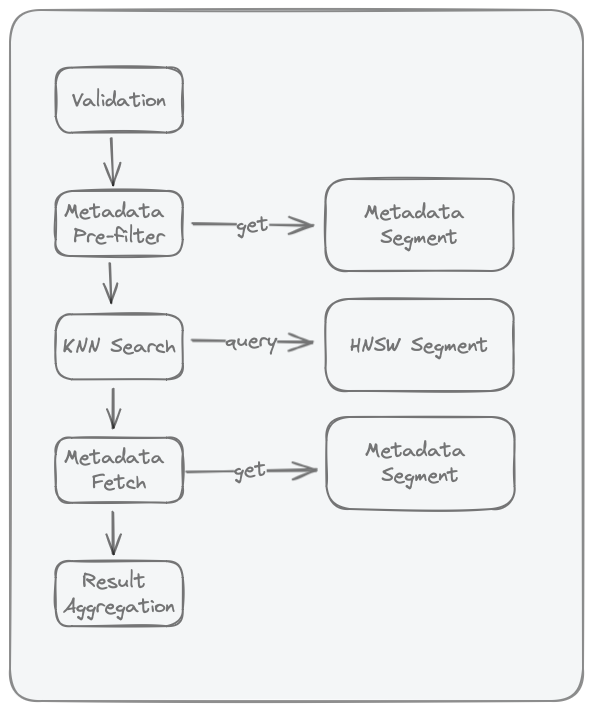

# Chroma Queries

This page explains what happens after you call `get()`, `query()`, or `search()`.

We reuse the same running example from [Search Concepts](../concepts.md#search-concepts):

- Query intent: "Find troubleshooting docs about SSO login failures."
- Constraints: only `status=published`, `year >= 2024`
- Output goal: top 20 results (`title` + `score`), without one product area dominating.

## Core Concepts

Modern Rust Chroma has two query execution paths:

- **Local single-node** (`query()/get()` path): local executor over `Sqlite` metadata + local HNSW segments.
- **Distributed / Cloud** (`search()` / distributed query workers): worker orchestrators over distributed segments (`BlockfileMetadata`, `BlockfileRecord`, `HnswDistributed`, `Spann`, `QuantizedSpann`) plus WAL/log materialization.

When a query runs, Chroma pulls from three storage/index families:

| Need | Local single-node | Distributed / Cloud |
| --- | --- | --- |
| Metadata + documents | SQLite tables + FTS5 (`where_document`) in `chroma.sqlite3` | Blockfile-backed record/metadata segments + recent log materialization |
| Vector ANN | Local HNSW segments (persisted or memory) | `HnswDistributed`, `Spann`, or `QuantizedSpann` (by collection config) |
| Ranking primitives | KNN (`query`) | KNN + sparse paths + rank expressions/fusion (`search`) |

For deeper Rust internals (segment families and Arrow-backed blockfiles), see [Concepts](../concepts.md#main-primitives-and-index-families) and [Blockfile Format and Update Model](../concepts.md#blockfile-format-and-update-model).

## Query Pipeline

Quick flow:

1. **Validation**: reject malformed requests early.
2. **Candidate selection**: apply filters/IDs to decide which records can compete.
3. **KNN/rank evaluation**: score and order eligible records.
4. **Field loading (projection/select)**: fetch the fields you asked for.
5. **Result aggregation**: return final rows in the requested shape.

The same idea in one line: **filter -> score -> load fields -> return page**.

??? note "Query Pipeline?"
    
    Why is it called a pipeline? Because each step in the query process depends on its predecessor's output.

## Advanced Search Semantics (Cloud + Local) {#advanced-search-semantics}

This section explains how query composition works beyond filter syntax.

### Stage Model

The same query intent is typically expressed as:

1. Candidate selection (filters)
2. Relevance ranking
3. Optional ranking fusion (hybrid)
4. Optional grouping/aggregation
5. Response shaping (pagination + field selection)

| Stage | What it controls | Local `query()/get()` | Cloud Search API |
| --- | --- | --- | --- |
| Candidate selection | Which records are eligible | `where`, `where_document` | `where(...)` |
| Relevance ranking | Order of eligible records | KNN over query embeddings | `rank(Knn(...))` or other rank expressions |
| Hybrid fusion | Merge multiple ranking signals | Not available as native query primitive | `rank(Rrf(...))` |
| Grouping/aggregation | Per-group diversity and caps | Not available as native query primitive | `groupBy(...)` (`MinK`/`MaxK`) |
| Response shaping | Size and returned fields | `limit`, `offset`, `include` | `limit`, pagination, `select` |

What each stage means:

- **Filters** decide what gets into the eligible pool.
- **Ranking** decides what goes first.
- **Fusion/grouping** decide how to balance quality and diversity.
- **Response shaping** decides what the client actually gets back.

### Boundary Rules

- Filters (`where`, `where_document`) define eligibility, not final order.
- Ranking defines order among eligible candidates.
- RRF is a rank-fusion step for combining multiple ranked lists.
- Grouping/aggregation reshapes already-ranked results.
- Pagination and field selection shape the final payload.

### Practical Tradeoffs

- **Filter selectivity affects latency**: tighter filters reduce the eligible pool before similarity search.
- **Ranking depth affects recall and latency**: deeper rank windows can improve recall but increase cost.
- **Hybrid helps lexical plus semantic intent**: use RRF when exact token matches and semantic matches both matter.
- **Grouping improves diversity**: use group caps when one category can dominate top results.

Example:

- Without grouping, top results might all come from `product_area=auth`.
- With `groupBy(product_area)` and a per-group cap, results are more balanced across areas.

### Where to go next

- [Filters](../filters.md) for exact operator syntax.
- [Search Concepts](../concepts.md#search-concepts) for the conceptual pipeline.
- [Search API Overview](https://docs.trychroma.com/cloud/search-api/overview) for request composition.
- [Ranking and Scoring](https://docs.trychroma.com/cloud/search-api/ranking), [Hybrid Search with RRF](https://docs.trychroma.com/cloud/search-api/hybrid-search), and [Group By & Aggregation](https://docs.trychroma.com/cloud/search-api/group-by) for Cloud behavior details.

### Validation

The following validations are performed:

- Validate `where` if present
- Validate `where_document` if present
- Ensure collection exists
- Validate query embeddings dimensions match that of the collection

Common failure patterns:

- typo in filter operator
- querying a collection with incompatible embedding dimensions
- requesting unsupported fields/options for the chosen API path

### Metadata Pre-Filter

Metadata pre-filter is the first narrowing step for filtered queries.

- In local/single-node Chroma, this stage evaluates `where` and `where_document` against the SQLite metadata segment.
- `where_document` is backed by SQLite FTS5 (`embedding_fulltext_search`) as documented in [Storage Layout](../storage-layout.md#metadata-segment).
- The output is an eligible ID set passed to the ANN stage; if no filters are provided, this stage is skipped.

Why this matters:

- Executing predicates before ANN search reduces unnecessary distance computations.
- Highly selective filters can reduce latency, but may also reduce the number of final hits if few records satisfy the predicate.

In our running example:

- `where: {"status":"published","year":{"$gte":2024}}`
- `where_document: {"$contains":"SSO"}`
- Only matching IDs move on to KNN/rank.

Research context:

- Filtered ANN is known to be harder than unfiltered ANN because vector proximity and predicate selectivity can be weakly correlated.
- See [ACORN (Patel et al., 2024)](https://arxiv.org/abs/2403.04871) and [Filtered-DiskANN (Gollapudi et al., WWW 2023)](https://doi.org/10.1145/3543507.3583552) for predicate-aware ANN design tradeoffs.

### KNN Search in HNSW Index

This stage runs approximate nearest-neighbor search over the collection's HNSW vector index.

- Chroma local stores one HNSW index per collection (see [Storage Layout](../storage-layout.md#collection-subdirectories)).
- If metadata pre-filter produced eligible IDs, the KNN stage searches within that constrained set.
- If `include` requests embeddings, vectors can be returned as part of this stage.

In our running example:

- Chroma scores the query embedding against only the allowed IDs.
- Lower distance means closer semantic match.

Tuning and tradeoffs:

- `ef_search` controls how many neighbors are explored at query time; increasing it typically improves recall at higher latency/memory cost.
- Construction knobs such as `max_neighbors` (HNSW `M`) and `ef_construction` influence graph quality and memory/ingest cost.
- Use current index configuration surfaces (`configuration.hnsw` / `configuration.spann`) rather than legacy `metadata` keys (see [Configuration](../configuration.md#hnsw-index-configuration)).
- For Cloud's schema-based configuration model (`VectorIndexConfig`, `HnswConfig`, `SpannConfig`), see [Index Configuration Reference](https://docs.trychroma.com/cloud/schema/index-reference) and [Schema Basics](https://docs.trychroma.com/cloud/schema/schema-basics).

Research context:

- HNSW's core idea is hierarchical small-world graph traversal with strong empirical recall/latency tradeoffs ([Malkov & Yashunin, 2016/2018](https://arxiv.org/abs/1603.09320)).
- For Cloud Search API ranking semantics (distance-style ordering, candidate limits, and expression behavior), see [Ranking and Scoring](https://docs.trychroma.com/cloud/search-api/ranking).

### Post-Search Field Loading (Projection / Hydration)

After KNN returns ranked records (`offset_id` + score), Chroma loads the requested fields to build the final payload.

- **Local single-node path**: the local executor performs an explicit follow-up `Get` over returned IDs to load documents/metadata when requested.
- **Distributed/Cloud query path**: worker execution uses `ProjectionOrchestrator`/`KnnProjection` (for `query/knn`) or `Select` in `RankOrchestrator` (for `search`) to load fields from record segments plus recent logs.
- In distributed execution, this is not a SQLite post-query; it is an operator-stage merge of compacted segment data and WAL/log materialization.

What this means:

- Ranking can stay fast because it moves IDs/scores first.
- Field loading happens afterward, only for the rows you keep.

Why this stage exists:

- ANN structures are optimized for vector neighborhood traversal, not full document/metadata row retrieval.
- Decoupling ANN from payload hydration is a common system pattern in vector retrieval pipelines.

Operational guidance:

- Requested fields directly affect this stage cost: keep payload small (`include` in local APIs, `select` in Cloud Search API) when low latency is important.
- For Cloud query composition and output shaping, see [Search API Overview](https://docs.trychroma.com/cloud/search-api/overview) and [Pagination & Selection](https://docs.trychroma.com/cloud/search-api/pagination-selection).
- For single-node metadata/FTS storage details, see [Storage Layout](../storage-layout.md#metadata-segment).

### Result Aggregation

Result aggregation fuses ranked neighbors with hydrated payloads and requested fields into the final response shape.

Example: if your request asks for `id`, `document`, and `score`, this is the stage that combines them into final rows (plus pagination/grouping effects, if configured).
