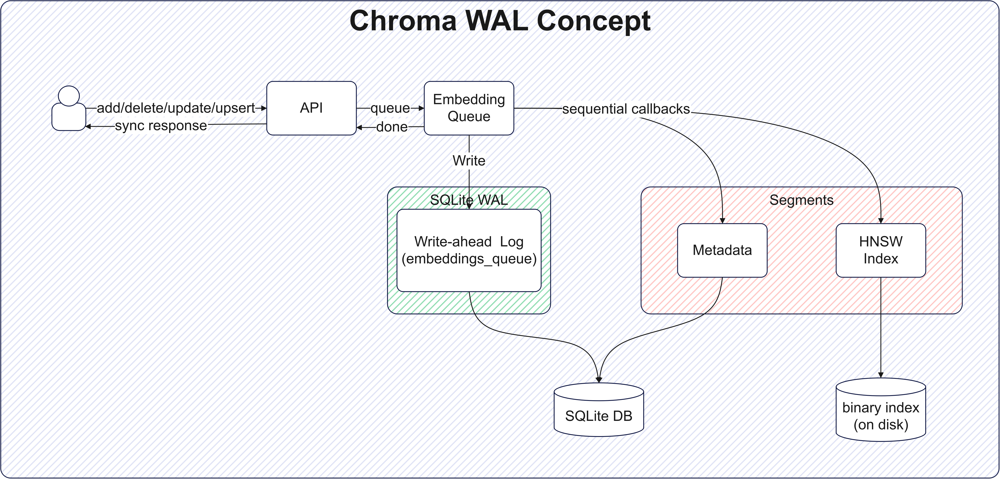
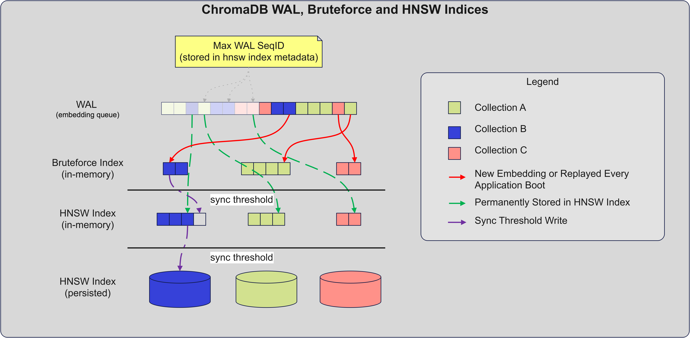
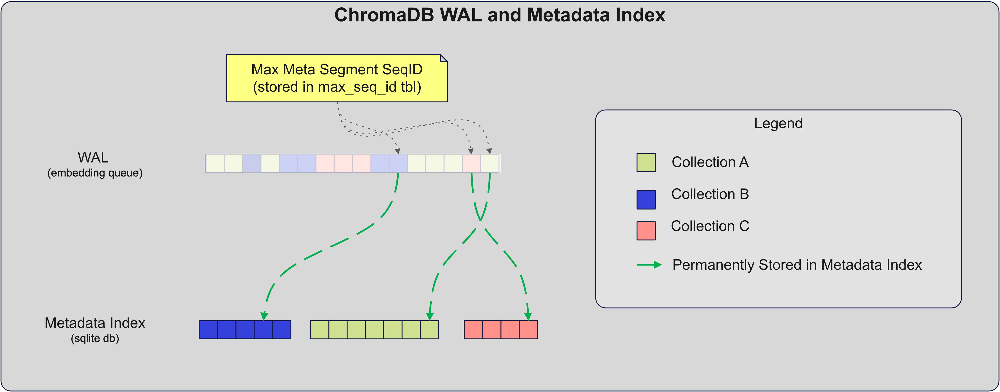

# Write-ahead Log (WAL)

Chroma uses WAL to ensure data durability, even if things go wrong (e.g. server crashes). To achieve the latter Chroma
uses what is known in the DB-industry as WAL or Write-Ahead Log. The purpose of the WAL is to ensure that each user
request (aka transaction) is safely stored before acknowledging back to the user. Subsequently, in fact immediately
after writing to the WAL, the data is also written to the index. This enables Chroma to serve as real-time search
engine, where the data is available for querying immediately after it is written to the WAL.

Below is a diagram that illustrates the WAL in ChromaDB (ca. v0.4.22):

{: style="width:100%"}

## Vector Indices Overview

The diagram below illustrates how data gets transferred from the WAL to the binary vector indices (Bruteforce and HNSW):

{: style="width:100%"}

For each collection Chroma maintains two binary indices - Bruteforce (in-memory, fast) and HNSW lib (persisted to disk,
slow when adding new vectors and persisting). As you can imagine, the BF index serves the role of a buffer that holds
the uncommitted to HNWS persisted index portion of the WAL. The HNSW index itself has a max sequence id counter, stored
in a metadata file, that indicates from which position in the WAL the buffering to the BF index should begin. The latter
buffering usually happens when the collection is first accessed.

There are two transfer points (in the diagram, sync threshold) for BF to HNSW:

- `hnsw:batch_size` - forces the BF vectors to be added to HNSW in-memory (this is a slow operation)
- `hnsw:sync_threshold` - forces Chroma to dump the HNSW in-memory index to disk (this is a slow operation)

- Both of the above sync points are controlled via Collection-level metadata with respective named params. It is
  customary `hnsw:sync_threshold` > `hnsw:batch_size`

## Metadata Indices Overview

The following diagram illustrates how data gets transferred from the WAL to the metadata index:

{: style="width:100%"}

## Further Reading

For the DevOps minded folks we have a few more resources:

- [WAL Pruning](./wal-pruning.md) - Clean up your WAL
