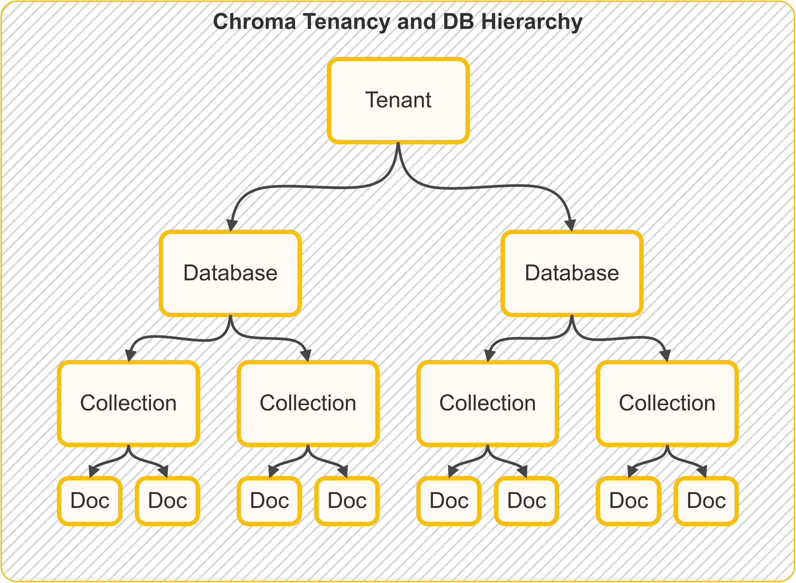

# Concepts

## Tenancy and DB Hierarchies

The following picture illustrates the tenancy and DB hierarchy in Chroma:

!!! warn "Storage"

    In Chroma single-node, all data about tenancy, databases, collections and documents is stored in a single SQLite database.

## Tenants

A tenant is a logical grouping for a set of databases. A tenant is designed to model a single organization or user. A
tenant can have multiple databases.

## Databases

A database is a logical grouping for a set of collections. A database is designed to model a single application or
project. A database can have multiple collections.

## Collections

Collections are the grouping mechanism for embeddings, documents, and metadata.

## Documents

!!! note "Chunks of text"

    Documents in ChromaDB lingo are chunks of text that fits within the embedding model's context window. 
    Unlike other frameworks that use the term "document" to mean a file, 
    ChromaDB uses the term "document" to mean a chunk of text.

Documents are raw chunks of text that are associated with an embedding. Documents are stored in the database and can be
queried for.

## Metadata

Metadata is a dictionary of key-value pairs that can be associated with an embedding. Metadata is stored in the
database and can be queried for.

Metadata values can be of the following types:

- strings
- integers
- floats (float32)
- booleans

## Embedding Function

Also referred to as embedding model, embedding functions in ChromaDB are wrappers that expose a consistent interface for
generating embedding vectors from documents or text queries.

For a list of supported embedding functions see Chroma's
official [documentation](https://docs.trychroma.com/integrations#%F0%9F%A7%AC-embedding-integrations).

## Distance Function

Distance functions help in calculating the difference (distance) between two embedding vectors. ChromaDB supports the
following distance functions:

- Cosine - Useful for text similarity
- Euclidean (L2) - Useful for text similarity, more sensitive to noise than `cosine`
- Inner Product (IP) - Recommender systems

## Embedding Model

## Embeddings

A representation of a document in the embedding model's latent space in te form of a vector, list of 32-bit floats (or
ints).

## Metadata Segment

The metadata segment holds both the documents and their respective metadata fields (if any). The metadata segment is
stored in sqlite3 under `<persistent_dir>/chroma.sqlite3`.

## Vector Segment

!!! tip "Segment or Index?"

    In the below paragraphs we use, the terms "segment" and "index" are used interchangeably.

Under the hood Chroma uses its
own [fork](https://github.com/chroma-core/hnswlib) [HNSW lib](https://github.com/nmslib/hnswlib) for indexing and
searching vectors.

In a single-node mode, Chroma will create a single vector index for each collection. The index is stored in a UUID-named
subdir in
your persistent dir, named after the vector segment of the collection.

The HNSW lib uses [fast ANN](https://arxiv.org/abs/1603.09320) algo to search the vectors in the index.

In addition to the HNSW index, Chroma uses Brute Force index to buffer embeddings in memory before they are added to the
HNSW index (see [`batch_size`](configuration.md#hnswbatch_size)). As the name suggests the search in the Brute Force
index is done by iterating over all the vectors in the index and comparing them to the query using the
distance_function. Brute Force index search is exhaustive and works well on small datasets.
