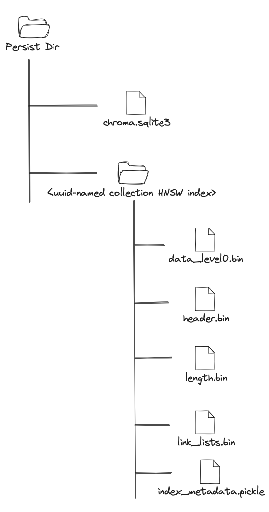

# Storage Layout

When configured as `PersistentClient` or running as a server, Chroma persists its data under the
provided `persist_directory`.

For `PersistentClient` the persistent directory is usually passed as `path` parameter when creating the client, if not
passed the default is `./chroma/` (relative path to where the client is started from).

For the server, the persistent directory can be passed as environment variable `PERSIST_DIRECTORY` or as a command line
argument `--path`. If not passed, the default is `./chroma/` (relative path to where the server is started).

Once the client or the server is started a basic directory structure is created under the persistent directory
containing the `chroma.sqlite3` file. Once collections are created and data is added, subdirectories are created for
each collection. The subdirectories are UUID-named and refer to the vector segment.

## Directory Structure

The following diagram represents a typical Chroma persistent directory structure:

### `chroma.sqlite3`

!!! note "Note about the tables"

    While we try to make it as accurate as possible chroma data layout inside the `slite3` database is subject to change.
    The following description is valid as of version `0.5.0`. The tables are also not representative of the distributed
    architecture of Chroma.

The `chroma.sqlite3` is typical for Chroma single-node. The file contains the following four types of data:

- Sysdb - Chroma system database, responsible for storing tenant, database, collection and segment information.
- WAL - the write-ahead log, which is used to ensure durability of the data.
- Metadata Segment - all metadata and documents stored in Chroma.
- Migrations - the database schema migration scripts.

#### Sysdb

The system database comprises the following tables:

- tenants - contains all the tenants in the system. Usually gets initialized with a single tenant - `default_tenant`.
- databases - contains all the databases per tenant. Usually gets initialized with a single
  database - `default_database` related to the `default_tenant`.
- collections - contains all the collections per database.
- collection_metadata - contains all the metadata associated with each collection. The metadata for a collection
  consists of any user-specified key-value pairs and the [`hnsw:*` keys](configuration.md#hnsw-configuration) that store
  the HNSW index parameters.
- segments - contains all the segments per collection. Each collection gets two segments - `metadata` and `vector`.
- segment_metadata - contains all the metadata associated with each segment. This table
  contains [`hnsw:*` keys](configuration.md#hnsw-configuration) that store the HNSW index parameters for the vector
  segment.

#### WAL

The write-ahead log is a table that stores all the changes made to the database. It is used to ensure that the data is
durable and can be recovered in case of a crash. The WAL is composed of the following tables:

- embeddings_queue - contains all data ingested into Chroma. Each row of the table represents an operation upon a
  collection (add, update, delete, upsert). The row contains all the necessary information (embedding, document,
  metadata and associated relationship to a collection) to replay the operation and ensure data consistency.
- max_seq_id - maintains the maximum sequence ID of the metadata segment that is used as a WAL replay starting point for
  the metadata segment.

#### Metadata Segment

The metadata segment is a table that stores all the metadata and documents stored in Chroma. The metadata segment is
composed of the following tables:

- embeddings -
- embedding_metadata - contains all the metadata associated with each document and its embedding.
- embedding_fulltext_search - document full-text search index. This is a virtual table and upon inspection of the sqlite
  will appear as a series of tables starting with `embedding_fulltext_search_`. This is an FTS5 table and is used for
  full-text search queries on documents stored in Chroma (via `where_document` filter in `query` and `get` methods).

#### Migrations

The migrations table contains all schema migrations applied to the `chroma.sqlite3` database. The table is used to track
the schema version and ensure that the database schema is up-to-date.

### Collection Subdirectories

TBD
