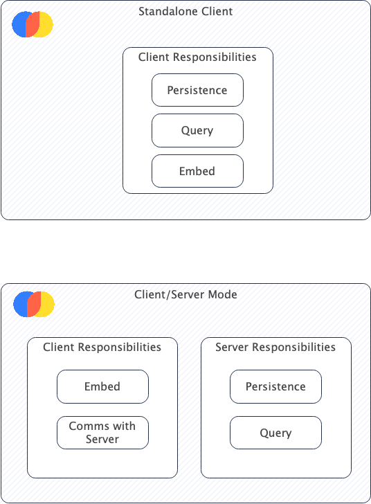

# Chroma System Constraints

This section contains common constraints of Chroma.

- Chroma is thread-safe
- Chroma is not process-safe
- Multiple Chroma Clients (Ephemeral, Persistent, Http) can be created from one or more threads within the same process
- A collection's name is unique within a Tenant and DB
- A collection's dimensions cannot change after creation => you cannot change the embedding function after creation
- Chroma operates in two modes - standalone (PersistentClient, EphemeralClient) and client/server (HttpClient with
  ChromaServer)
- The distance function cannot be changed after collection creation.

## Operational Modes

Chroma can be operated in two modes:

- Standalone - This allows embedding Chroma in your python application without the need to communicate with external
  processes.
- Client/Server - This allows embedding Chroma in your python application as a thin-client with minimal dependencies and
  communicating with it via REST API. This is useful when you want to use Chroma from multiple processes or even
  multiple machines.

Depending on the mode you choose, you will need to consider the following component responsibilities:

- Standalone:
    - Clients (Persistent, Ephemeral) - Responsible for persistence, embedding, querying
- Client/Server:
    - Clients (HttpClient) - Responsible for embedding, communication with Chroma server via REST API
    - Server - Responsible for persistence and querying

