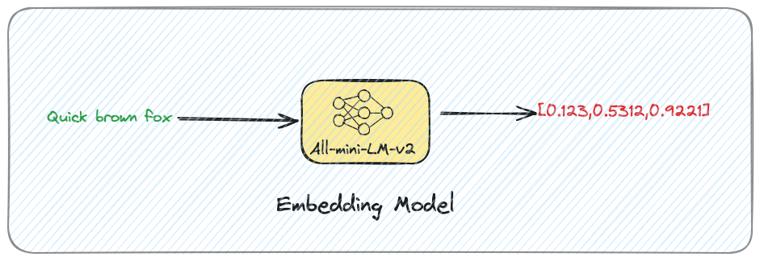

# Embedding Models

!!! note "Work in Progress"
This page is a work in progress.

Embedding Models are your best friends in the world of Chroma, and vector databases in general. They take something you
understand in the form of text, images, audio etc. and turn it into a list of numbers (embeddings), which a machine
learning
model can understand. This process makes documents interpretable by a machine learning model.

The goal of this page is to arm you with enough knowledge to make an informed decision about which embedding model to
choose for your use case.

!!! tip "The importance of a model"

    GenAI moves pretty fast therefore we recommend not to over-rely on models too much. When creating your
    solution create the necessary abstractions and tests to be able to quickly experiment and change things up
    (don't overdo it on the abstraction though).

## Characteristics of an Embedding Model

- Modality - the type of data each model is designed to work with. For example, text, images, audio, video. Note: Some
  models can work with multiple modalities (e.g. [OpenAI's CLIP](https://github.com/openai/CLIP)).
- Context - The maximum number of tokens the model can process at once.
- Tokenization - The model's tokenizer or the way a model turns text into tokens to process.
- Dimensionality - The number of dimensions in the output embeddings/vectors.
- Training Data - The data the model was trained on.
- Execution Environment - How the model is run (e.g. local, cloud, API).
- Loss Function - The function used to train the model e.g. how well the model is doing in predicting the embeddings,
  compared to the actual embeddings.

## Model Categories

There are several ways to categorize embedding models other than the above characteristics:

- Execution environment e.g. API vs local
- Licensing e.g. open-source vs proprietary
- Privacy e.g. on-premises vs cloud

## Execution Environment

The execution environment is probably the first choice you should consider when creating your GenAI solution.
Can I afford my data to leave the confines of my computer, cluster, organization? If the answer is yes and you are still
in the experimentation phase of your GenAI journey we recommend using API-based embedding models.

