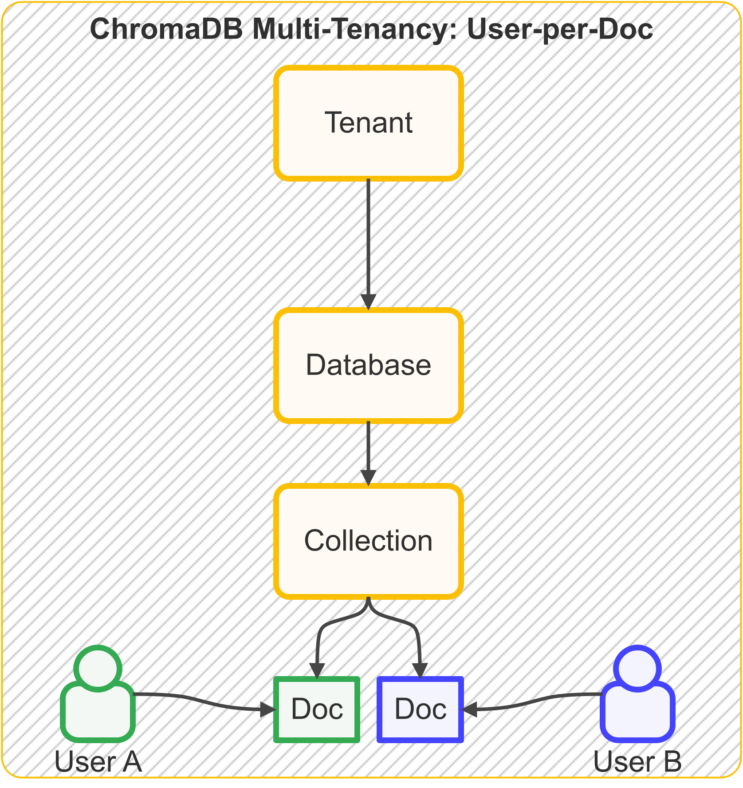
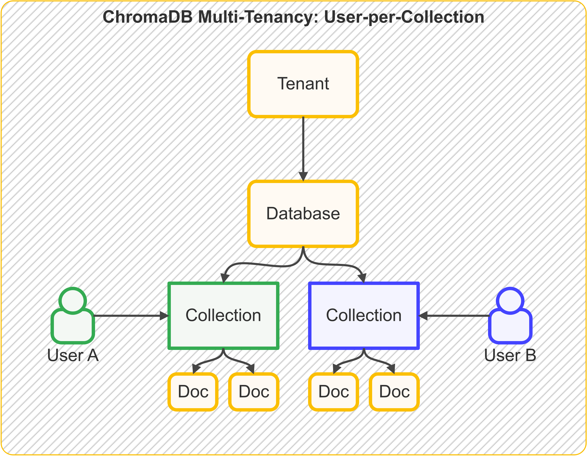
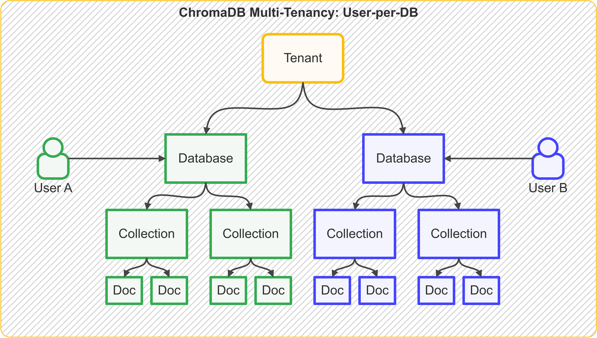
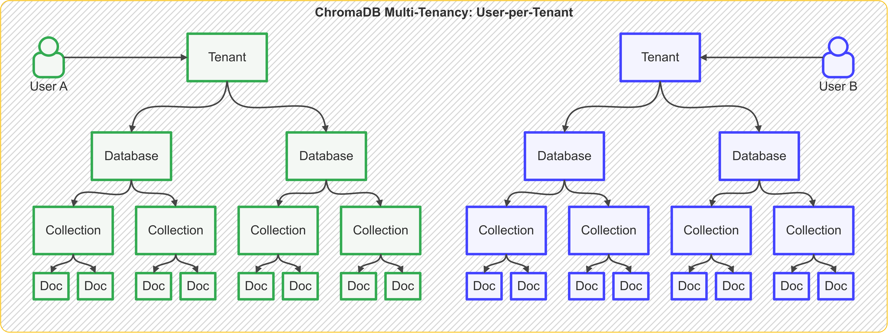

# Multi-tenancy Strategies

!!! note "Single-note Chroma"

    The below strategies are applicable to single-node Chroma only. The strategies require your app to act as both PEP (Policy Enforcement Point) 
    and PDP (Policy Decision Point) for authorization.

!!! warn "Authorization"

    We are in the process of creating a list of articles on how to implement proper authorization in Chroma, 
    leveraging the an external service and Chroma's auth plugins. The first article of the series is available in 
    [Medium](https://medium.com/@amikostech/implementing-multi-tenancy-in-chroma-part-1-multi-user-basic-auth-a4e790f1254d) 
    and will also be made available here soon.

## Introduction

There are several multi-tenancy strategies available to users of Chroma. The actual strategy will depend on the needs of
the user and the application. The strategies below apply to multi-user environments, but do no factor in partly-shared
resources like groups or teams.

- **User-Per-Doc**: In this scenario, the app maintains multiple collections and each collection document is associated
  with a single user.
- **User-Per-Collection**: In this scenario, the app maintains multiple collections and each collection is
  associated with a single user.
- **User-Per-Database**: In this scenario, the app maintains multiple databases with a single tenant and each database
  is
  associated with a single user.
- **User-Per-Tenant**: In this scenario, the app maintains multiple tenants and each tenant is associated with a single
  user.

## User-Per-Doc

The goal of this strategy is to grant user permissions to access individual documents.



To implement this strategy you need to add some sort of user identification to each document that belongs to a user.
For this example we will assume it is `user_id`.

```python
import chromadb

client = chromadb.PersistentClient()
collection = client.get_or_create_collection("my-collection")
collection.add(
    documents=["This is document1", "This is document2"],
    metadatas=[{"user_id": "user1"}, {"user_id": "user2"}],
    ids=["doc1", "doc2"],
)
```

At query time you will have to provide the `user_id` as a filter to your query like so:

```python
results = collection.query(
    query_texts=["This is a query document"],
    where=[{"user_id": "user1"}],
)
```

To successfully implement this strategy your code needs to consistently add and filter on the `user_id` metadata to
ensure separation of data.

**Drawbacks**:

- Error-prone: Messing up the filtering can lead to data being leaked across users.
- Scalability: As the number of users and documents grow, doing filtering on metadata can become slow.

## User-Per-Collection

The goal of this strategy is to grant a user access to all documents in a collection.



To implement this strategy you need to create a collection for each user. For this example we will assume it is
`user_id`.

```python
import chromadb

client = chromadb.PersistentClient()
user_id = "user1"
collection = client.get_or_create_collection(f"user-collection:{user_id}")
collection.add(
    documents=["This is document1", "This is document2"],
    ids=["doc1", "doc2"],
)
```

At query time you will have to provide the `user_id` as a filter to your query like so:

```python
user_id = "user1"
user_collection = client.get_collection(f"user-collection:{user_id}")
results = user_collection.query(
    query_texts=["This is a query document"],
)
```

To successfully implement this strategy your code needs to consistently create and query the correct collection for the
user.

**Drawbacks**:

- Error-prone: Messing up the collection name can lead to data being leaked across users.
- Shared document search: If you want to maintain some documents shared then you will have to create a separate
  collection for those documents and allow users to query the shared collection as well.

## User-Per-Database

The goal of this strategy is to associate a user with a single database thus granting them access to all collections and
documents within the database.



```python
import chromadb
from chromadb import DEFAULT_TENANT
from chromadb import Settings

adminClient = chromadb.AdminClient(Settings(
    is_persistent=True,
    persist_directory="multitenant",
))


# For Remote Chroma server:
# 
# adminClient= chromadb.AdminClient(Settings(
#   chroma_api_impl="chromadb.api.fastapi.FastAPI",
#   chroma_server_host="localhost",
#   chroma_server_http_port="8000",
# ))

def get_or_create_db_for_user(user_id):
    database = f"db:{user_id}"
    try:
        adminClient.get_database(database)
    except Exception as e:
        adminClient.create_database(database, DEFAULT_TENANT)
    return DEFAULT_TENANT, database


user_id = "user_John"

tenant, database = get_or_create_db_for_user(user_id)
# replace with chromadb.HttpClient for remote Chroma server
client = chromadb.PersistentClient(path="multitenant", tenant=tenant, database=database)
collection = client.get_or_create_collection("user_collection")
collection.add(
    documents=["This is document1", "This is document2"],
    ids=["doc1", "doc2"],
)
```

In the above code we do the following:

- We create or get a database for each user in the `DEFAULT_TENANT` using the `chromadb.AdminClient`.
- We then create a `PersistentClient` for each user with the `tenant` and `database` we got from the `AdminClient`.
- We then create or get collection and add data to it.

**Drawbacks**:

- This strategy requires consistent management of tenants and databases and their use in the client application.

## User-Per-Tenant

The goal of this strategy is to associate a user with a single tenant thus granting them access to all databases,
collections, and documents within the tenant.



```python
import chromadb
from chromadb import DEFAULT_DATABASE
from chromadb import Settings

adminClient = chromadb.AdminClient(Settings(
    chroma_api_impl="chromadb.api.segment.SegmentAPI",
    is_persistent=True,
    persist_directory="multitenant",
))


# For Remote Chroma server:
# 
# adminClient= chromadb.AdminClient(Settings(
#   chroma_api_impl="chromadb.api.fastapi.FastAPI",
#   chroma_server_host="localhost",
#   chroma_server_http_port="8000",
# ))

def get_or_create_tenant_for_user(user_id):
    tenant_id = f"tenant_user:{user_id}"
    try:
        adminClient.get_tenant(tenant_id)
    except Exception as e:
        adminClient.create_tenant(tenant_id)
        adminClient.create_database(DEFAULT_DATABASE, tenant_id)
    return tenant_id, DEFAULT_DATABASE


user_id = "user1"

tenant, database = get_or_create_tenant_for_user(user_id)
# replace with chromadb.HttpClient for remote Chroma server
client = chromadb.PersistentClient(path="multitenant", tenant=tenant, database=database)
collection = client.get_or_create_collection("user_collection")
collection.add(
    documents=["This is document1", "This is document2"],
    ids=["doc1", "doc2"],
)
```

In the above code we do the following:

- We create or get a tenant for each user with `DEFAULT_DATABASE` using the `chromadb.AdminClient`.
- We then create a `PersistentClient` for each user with the `tenant` and `database` we got from the `AdminClient`.
- We then create or get collection and add data to it.

**Drawbacks**:

- This strategy requires consistent management of tenants and databases and their use in the client application.
